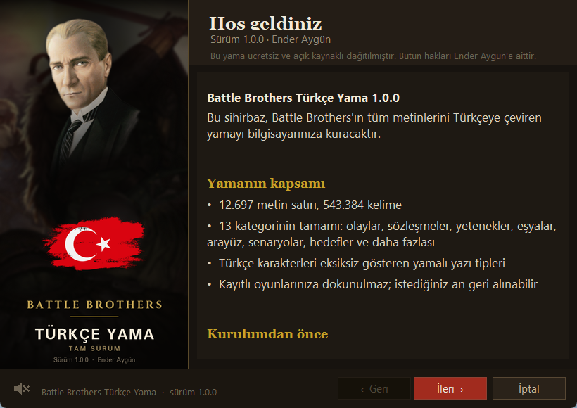
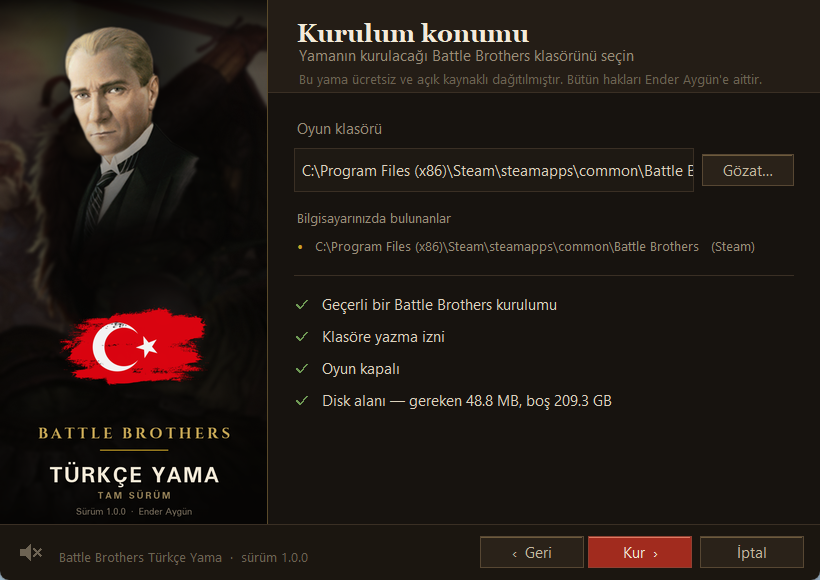
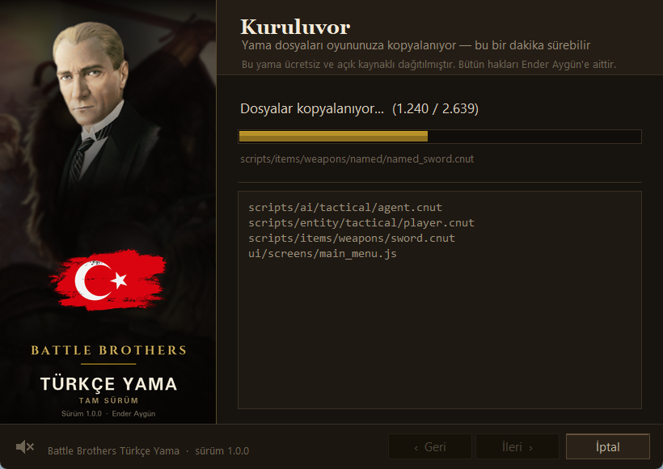
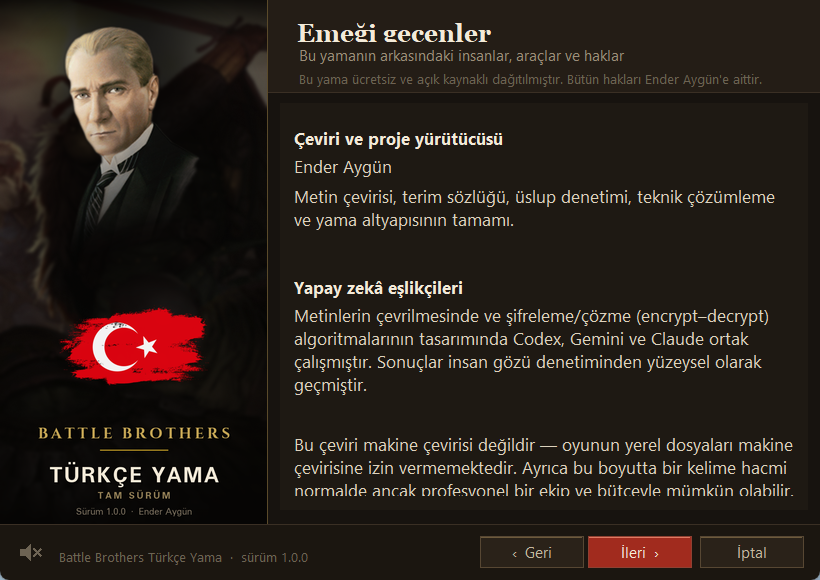
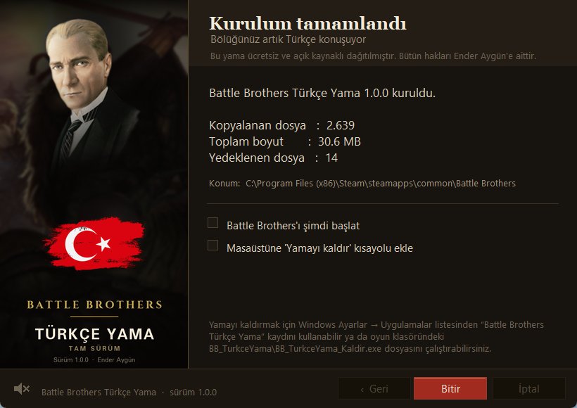

# Battle Brothers Türkçe Yama

**Oyunun tamamı — 12.697 satır, 543.384 kelime — %100 Türkçe.**

[**⬇ Kurulum dosyasını indir**](../../releases/latest) · [Ekran görüntüleri](#ekran-görüntüleri) · [SSS](#sık-sorulan-sorular)

 

  

## Bu yama ne yapar

Battle Brothers'ın olay metinlerini, görev sözleşmelerini, yeteneklerini,
eşyalarını, arayüzünü, senaryolarını ve daha fazlasını Türkçeye çevirir.
13 kategorinin tamamı bitti, tek satır İngilizce kalmadı. Oyunun Türkçe
karakterleri (ç, ğ, ı, İ, ö, ş, ü) düzgün gösterebilmesi için yazı tipleri de
ayrıca yamalandı.

Kurulum sihirbazı üzerine yazdığı her dosyanın yedeğini alır; kaldırdığınızda
oyun bıraktığınız hâline döner. Kayıtlı oyunlarınıza dokunulmaz.

## Kurulum

1. [**Releases**](../../releases/latest) sayfasından `BattleBrothers_TurkceYama_Kurulum_*.exe` dosyasını indirin.
2. Battle Brothers'ı kapatın.
3. İndirdiğiniz `.exe`'yi çalıştırın ve sihirbazı izleyin — oyun klasörünü
   genelde kendisi bulur (Steam ve GOG kurulumları taranır).
4. Kurulum bitince oyunu açın; menüler ve metinler Türkçe olacaktır.

> **Windows SmartScreen uyarısı çıkarsa:** Yama küçük bağımsız bir geliştirici
> tarafından yapıldığı ve Microsoft'a imzalatılmadığı için Windows "Tanınmayan
> uygulama" uyarısı gösterebilir. **Diğer bilgiler** → **Yine de çalıştır**
> yolunu izleyin. Kaynak kodu isteyen için açıktır; dilerseniz kurmadan önce
> inceleyebilirsiniz.

## Kaldırma

Oyun klasöründeki `BB_TurkceYama\BB_TurkceYama_Kaldir.exe` dosyasını çalıştırın,
ya da Windows **Ayarlar → Uygulamalar** listesinden **Battle Brothers Türkçe
Yama**'yı kaldırın. Yamanın değiştirdiği her dosya özgün hâline döner.

## Ekran görüntüleri

  
  

  
  

## Sık sorulan sorular

**Oyun güncellenince yama bozulur mu?**
Bazı metinler İngilizceye dönebilir; böyle bir durumda yamayı yeniden kurmanız
yeterlidir.

**Kayıtlı oyunlarım etkilenir mi?**
Hayır. Yama yalnızca metinleri değiştirir, kayıt dosyalarına dokunmaz. Yamalı
ve yamasız oyun arasında geçiş yapabilirsiniz.

**Bazı isimler neden hâlâ İngilizce (Unhold, Schrat, Wiederganger…)?**
Bilinçli bir tercih. Bu isimler özgün hâlleriyle bırakıldı, eksiklik değil.

**Bu resmî bir yama mı?**
Hayır. Battle Brothers © Overhype Studios. Bu yama resmî değildir, Overhype
Studios ile hiçbir bağı yoktur. Oyunun özgün dosyalarını içermez; yalnızca
sizin yasal olarak sahip olduğunuz kurulumun metinlerini Türkçeleştirir.
Oyunu ayrıca satın almış olmanız gerekir.

**Ücretsiz mi?**
Evet, tamamen ve sonsuza dek. Yamanın satılması, ücretli bir pakete dahil
edilmesi ya da üyelik/bağış şartına bağlanarak paylaşılması yasaktır. Yalnızca
bu depodan indirin — başka yerlerde dolaşan, para ya da ek program isteyen
sürümler bu projeye ait değildir.

## Nasıl yapıldı

Metinler ileri düzey yapay zekâ araçları (Codex, Gemini, Claude) eşliğinde,
insan kontrolünden geçirilerek çevrildi — makine çevirisi değildir; oyunun
kendi dosya biçimi zaten buna izin vermiyor. Terim tutarlılığı bir sözlük ve
özel-ad kurallarıyla korundu.

## Lisans

[MIT](LICENSE) — [Ender Aygün](https://github.com/Pandomentall)
